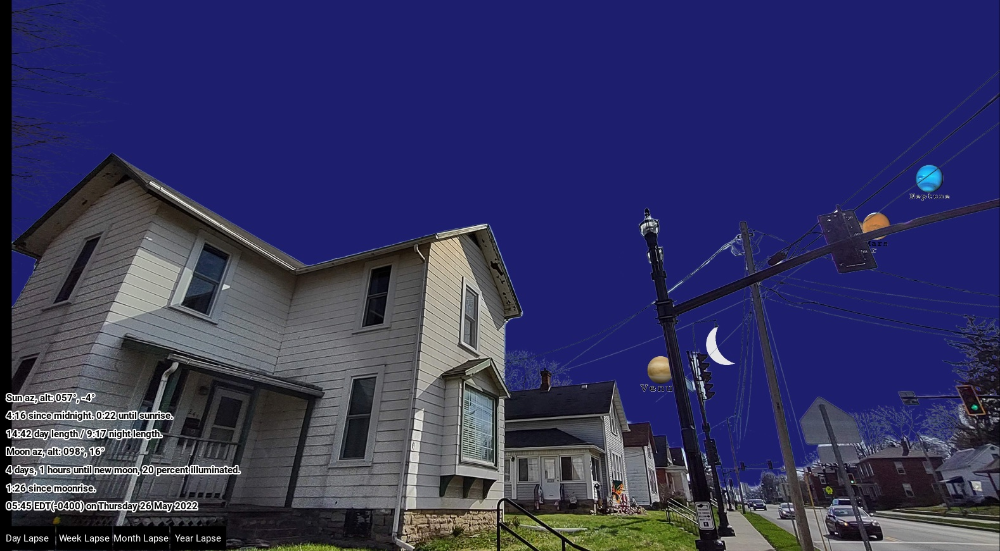
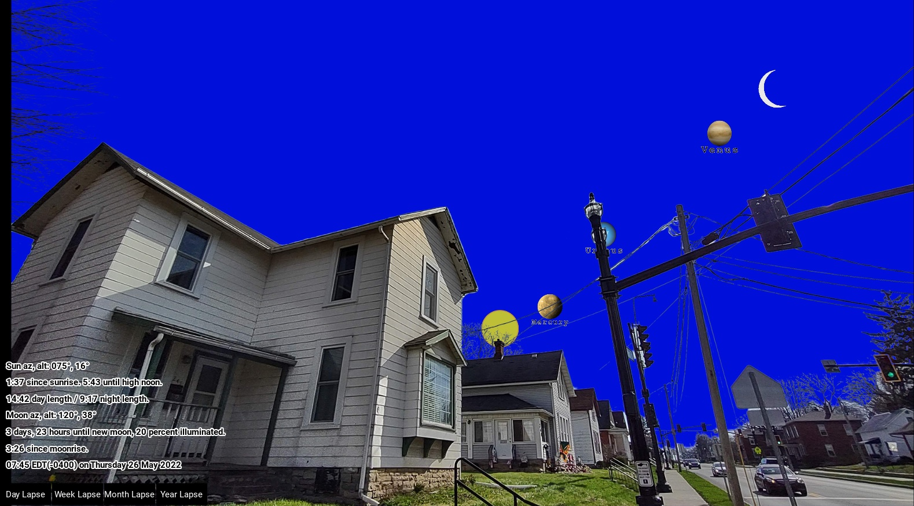
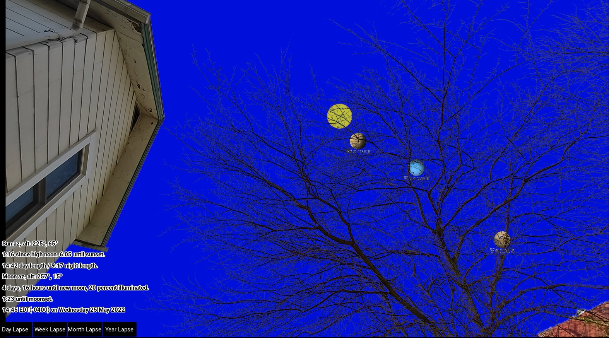
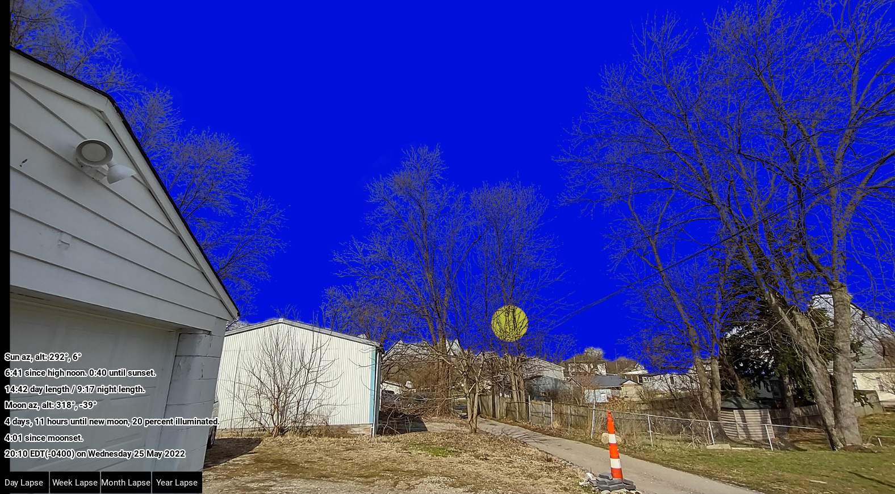
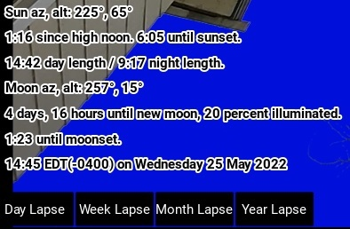

# Astronomical Clock by Time v3 Technology
The Time v3 Technology astronomical clock is designed to be the most user-friendly astronomical clock in history. By using photographs digitally marked with astronomical data, the clock places the sun, moon, and stars on familiar photos in real time.

The Time v3 Astronomical Clock is a practical application of the [AstroWideImageMapper project](https://github.com/rr34/AstroWideImageMapper).

## Images from the Clock
The following images are from around our house displayed on the clock. If I look at the clock inside my house, then step outside, I see the celestial objects where they are in the photo.

The images are PNG with the sky photoshopped to transparency and a background single-color sky image as the bottom layer. Notice the dark purple color of the sky in this photo with the sun (not visible) 4° below the horizon (sun location information shown in bottom left corner). The sky changes color based on the angle of the sun below the horizon, with bright blue during the day, several transition colors, then black when darker than astronomical twightlight.  

The phase of the moon is correct, *including* the direction the bright side of the moon appears in the sky. The planets are correctly placed on the clock for the time shown. The planets are lined up in a plane with the sun because in real life the planets orbit in nearly the same plane. Currently, all 7 other planets happen to nearly fit in a single image at the same time.  

Notice the sun and planets appear realistically behind the tree branches, but with just enough of an "animation look" to show it is a computer representation.  

The sun sets over the alley behind our house in its correct northwest position.  

The information in the corner is based entirely on actual celestial events, with the one exception being the bottom line that displays local "industrial time" and date.  

## TODO
+ add stars
+ follow stars when sun and moon not visible
+ enable user to set the time in case internet is not available.
+ label: post-industrial clock by Time v3 Technology, Delaware, Ohio
+ implement "is on image" function better 1. on image is anytime < 255 opacity 2. image bounds with border inside edges 3. still favor big blur partial covered 4. show sunrise sunset location during civil twighlight
+ make smooth animations?
+ pytz on raspberry pi
+ change text of buttons while calculating?
+ gradually change the color of the sky instead of incrementally? or not, transition gives user an idea of how the different twightlights are defined.